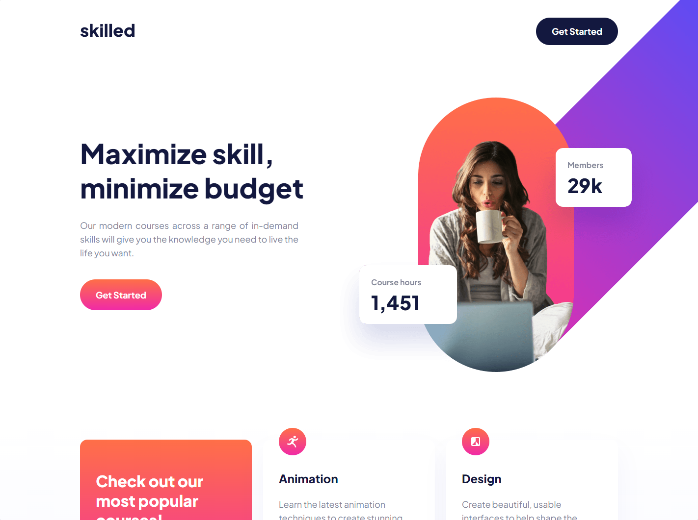

# Frontend Mentor - Skilled e-learning landing page solution

This is a solution to the [Skilled e-learning landing page challenge on Frontend Mentor](https://www.frontendmentor.io/challenges/skilled-elearning-landing-page-S1ObDrZ8q). Frontend Mentor challenges help you improve your coding skills by building realistic projects.

## Table of contents

- [Frontend Mentor - Skilled e-learning landing page solution](#frontend-mentor---skilled-e-learning-landing-page-solution)
  - [Table of contents](#table-of-contents)
  - [Overview](#overview)
    - [The challenge](#the-challenge)
    - [Screenshot](#screenshot)
    - [Links](#links)
  - [My process](#my-process)
    - [Built with](#built-with)
  - [Author](#author)

## Overview

### The challenge

Users should be able to:

- View the optimal layout depending on their device's screen size
- See hover states for interactive elements

### Screenshot

### Links

- Solution URL: [GitHub](https://github.com/lucasdaher/skilled-landing-page)
- Live Site URL: [Live Site](https://lucasdaher-skilled-lp.vercel.app/)

## My process
I started the project by preparing React with Vite. I created all the necessary folders and files right away and started the development of the Landing Page by components and styling using SASS. After completing all the functional part and styling I went to responsiveness according to the suggested sizes.

### Built with

- Semantic HTML5 markup
- CSS custom properties
- CSS positions
- Flexbox
- CSS Grid
- Mobile-first workflow
- [React](https://reactjs.org/) - JS library
- [SASS](https://https://sass-lang.com/) - Sass is a stylesheet language that’s compiled to CSS

## Author

- GitHub - [Lucas Daher](https://github.com/lucasdaher)
- Frontend Mentor - [@lucasdaher](https://www.frontendmentor.io/profile/lucasdaher)
